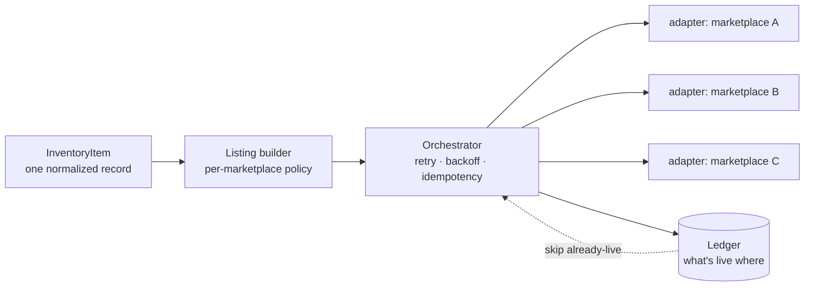

# Sales Agent — Multi-Marketplace Resale Automation (Showcase)

[](https://github.com/ArtJack/sales-agent-showcase/actions/workflows/ci.yml)

**Status: 🚧 In progress — a sanitized showcase of a system I'm building for a live, revenue-generating client (an anonymous US-based resale business).**

Resellers sell the *same* inventory across many marketplaces at once. Doing that
by hand — re-typing each item into eBay, Poshmark, Depop, Grailed, Vinted, and
Vestiaire, then keeping prices and "is it still listed?" in sync — is slow and
error-prone. This system lists an item **once** and cross-posts it everywhere,
unattended, without double-posting.

> ### ⚠️ This is a clean-room showcase, not the product
> The production code is **private**. The real marketplace integrations are
> proprietary client work and stay out of this repo. Everything here is a
> **re-implementation of the architecture** with **fake adapters** (no network,
> no credentials) and **synthetic data**. See [`NOTICE`](./NOTICE).

---

## What it does

Describe an item once in a marketplace-agnostic shape, hand it to the
orchestrator, and it renders a per-marketplace listing and publishes to each —
with retries, fast-fail on rejections, and idempotency so re-running never
double-posts. Run it yourself:

```bash
python3 demo.py     # pure stdlib, no install needed
```

```text
PASS 1 — fresh inventory
SKU-1002  Marlowe Leather Crossbody Bag  →  3 live · 0 skipped · fully listed
    marketplace-alpha    ✓ marketplace-alpha-131d3f72ca  (2 attempts, 46ms)   ← retried a transient error
    marketplace-beta     ✓ marketplace-beta-fb55be4eb5   (1 attempt, 142ms)
    marketplace-gamma    ✓ marketplace-gamma-bfb20cd96a  (1 attempt, 188ms)

SKU-1005  Velocity Running Sneakers  →  2 live · 0 skipped · 1 failed
    marketplace-gamma    ✗ permanent: rejected SKU-1005 (failed listing validation)   ← reported, not retried

PASS 2 — idempotent re-run (everything already live is skipped)
SKU-1002  ...  →  0 live · 3 skipped · fully listed     ← no double-posting
```

Full transcript: [`docs/sample-output.txt`](./docs/sample-output.txt). The demo
runs three **fake** adapters; the production system spans six real marketplaces.

## Architecture



```text
                                      ┌─→ adapter A ─┐
InventoryItem ─→ Listing builder ─→ Orchestrator ─┼─→ adapter B ─┼─→ Ledger
 (normalized)    (per-mkt policy)   (retry/backoff/ └─→ adapter C ─┘  (what's live
                                     idempotency)                      where) ─┐
                                          ↑──────── skip already-live ─────────┘
```

One **normalized domain model** (`InventoryItem`) is the single source of truth.
A **listing builder** turns it into each marketplace's required shape under a
`ListingPolicy` (title length, tag count, etc.). The **orchestrator** publishes
through a uniform `MarketplaceClient` adapter interface — so it never knows which
marketplace it's talking to — and records results in a **ledger** that makes
re-runs idempotent.

## Engineering decisions (and the trade-offs behind them)

- **Deterministic listings — an LLM never touches a field a buyer pays against.**
  Titles, prices, and tags are generated by pure, tested rules, not a model
  improvising on the numbers a sale depends on. (Production adds an *optional* LLM
  pass for description prose only, behind review.) In a market full of
  "AI-does-everything" demos, this restraint is the point.
- **Adapter pattern, marketplace-agnostic core.** Every marketplace hides behind
  one tiny `publish(listing) -> id` protocol, so the pipeline never knows which
  platform it's talking to. Adding a marketplace is a new adapter, not a change to
  the pipeline. (In production each adapter is proprietary client work; here
  they're fakes.)
- **Bounded retries with backoff, fast-fail on permanent errors.** Transient
  failures (rate limits, timeouts) are retried with exponential backoff;
  validation rejections fail immediately and are reported. Partial failure is a
  first-class outcome, not a crash.
- **Idempotency via a ledger.** The ledger is keyed on `(sku, marketplace)`, so an
  UPSERT can't create a duplicate and a re-run only posts what isn't already live
  — the property that makes "run it on a schedule, unattended" safe.
- **Tested.** 14 tests cover the retry/backoff state machine, permanent-vs-
  transient handling, idempotent skips, partial-failure reporting, and the
  deterministic listing rules.

## Project layout

```
src/sales_showcase/
  models.py        # InventoryItem, Listing, PublishResult
  listing.py       # deterministic, policy-driven listing generation
  marketplace.py   # MarketplaceClient protocol + FakeMarketplaceClient (stub)
  orchestrator.py  # cross_post: retry, backoff, idempotency, reporting
  ledger.py        # SQLite ledger of what's live where
demo.py            # runnable end-to-end demo on synthetic data
examples/          # synthetic inventory
tests/             # pytest suite (14 tests)
scripts/scan.sh    # secret/leak scan (run before pushing)
```

## Run it

```bash
python3 demo.py                     # end-to-end demo (stdlib only, no install)

# Tests — use a virtualenv (modern macOS/Linux mark the system Python "externally managed"):
python3 -m venv .venv && . .venv/bin/activate
pip install -e '.[dev]'
pytest                              # 14 tests
```

## The production system (private)

The real system is built for a paying client: it cross-posts across the major
resale marketplaces (eBay, Poshmark, Depop, Grailed, Vinted, Vestiaire) behind
proprietary per-marketplace adapters, with a migrated database and listing-content
generation. Those adapters and the client's data are private. This repo is that
architecture, rebuilt clean-room and runnable, so you can read exactly how it's
engineered.

## License

[MIT](./LICENSE) — covers this clean-room showcase code only.

---

Built by **[ArtJeck Technology](https://artjeck.com)** — AI automation and
product engineering. Showcases are runnable and tested.
